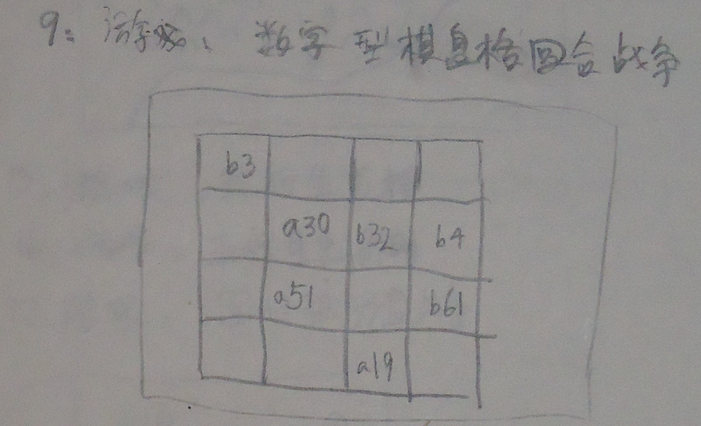

# 要素之物质

相当于主体、算子、兵、智能体。

物质的分类：
- 生命物质；
- 非生命物质；

## 物质之分类

### 生命物质

生命物质在棋类游戏中的表现为主体。

### 主体的分类

主体的分类：

- 按照主体是否可以移动：
	- 主体可以移动
	- 主体不可以移动
	
- 按照主体是否融入运动空间，作为运动空间的一部分：
	- 完全融入
	- 不完全融入
	
- 按照展现形式：

  - 每个主体抽象为一个点
    - 表现形式：
      - 表现形式为一个像素点
      - 表现形式为一个含数据信息的数据点
      - 表现形式为一个视觉上的符号
  - 每个主体抽象成一个图标；
  - 每个主体视为具体形象；

- 按照拓扑形状：

  - 拓扑点
  - 拓扑线
  - 拓扑网

  

#### 主体可以移动

代表游戏：象棋、军棋等。

#### 主体不可以移动

代表游戏：围棋。

#### 主体是否融入运动空间

按主体是否融入运动空间，作为运动空间的一部分，意思是主体是否本身可以是运动空间之位置之非空子集。

#### 主体完全融入运动空间

代表游戏：《土地之争棋》

#### 主体不完全融入运动空间

TODO

#### 展现形式

展现形式按主体自身包含的信息在视觉上的表现方式。

#### 每个主体抽象为一个点

每个主体抽象为一个点，在视觉上可以表现为节点或者像素点。

#### 表现形式为一个像素点

#### 表现形式为一个含数据信息的数据点

代表游戏：《数字型运动空间格回合棋》

#### 表现形式为一个视觉上的符号

TODO

#### 每个主体抽象成一个图标

比如兵棋里的标准图标；

#### 每个主体看成具体形象

#### 主体的拓扑形状

#### 主体形状表现为拓扑点

### 非生命物质

## 物质之属性