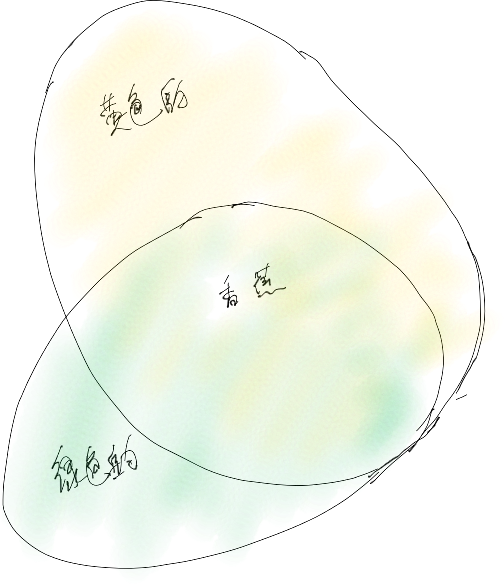
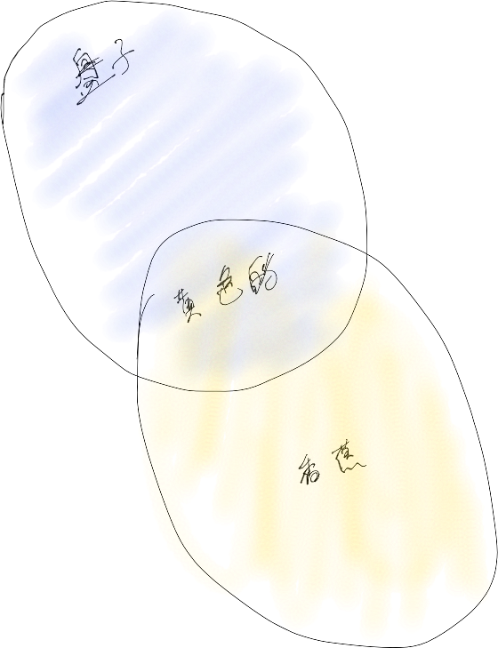
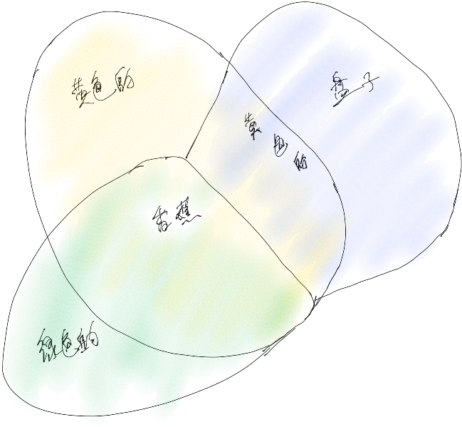

# 概念整合与正反向传播

![[概念整合与正反向传播_20220719.m4a]]

- [ ] (@[[2022-07-23]]) 概念整合与正反向传播

[[关系之于集合与逻辑运算]]

首先以一个案例为引导。

对于香蕉🍌。有以下属性：

香蕉之属性：

- 颜色
- 味道
- 用途
- ……

与香蕉类有关的属性之键值对集合有：

- 香蕉：
  - 属性：
    - 颜色：【红色的、浅色的、深色的、绿色的】
    - 味道：【甜味的、酸味的】
    - 用途：【吃、种植】
    - 成熟度：【成熟的 $\xleftrightarrow{几分熟}$ 生的】
    - 产地：【南方、北方】

类似地，水果类也有相关的属性之键值对集合。以至于对于任何对象，都有相关的属性。从而有如下关系：
$$
\begin{equation}
香蕉类.属性.键值对集合 \subseteq 水果类.属性.键值对集合 \subseteq 万物类.属性.键值对集合
\end{equation}
$$
同样地，对于单个对象与类之相关的属性之键值对集合，也有如下关系：
$$
\begin{equation}
单个香蕉对象之属性之键值对 \subseteq 香蕉类之属性之键值对
\end{equation}
$$
且有如下的定理：

定理1：
$$
\sum_{各香蕉个体}香蕉个体i.属性.键值对集合
$$

# 图说属性

颜色属性：

味道属性：

# 训练识别香蕉过程

输入值训练数据集，应包括：

- 各个单个对象之香蕉之属性之键值，作为具象之概念；
- 各个单个对象之香蕉之非属性之键值，作为具象之干扰概念信息；

训练过程中，通过以下运算逐渐地实现目标：

1. 并运算：抽象化香蕉之于那些具象的香蕉，其具有正确的属性，如黄色的香蕉、甜的香蕉等；
1. 交运算：抽象化香蕉之于那些具象的香蕉，其不具备正确的属性，如黄色的盘子、桌子等；

以下以像素图像为例：目标是识别香蕉类。

