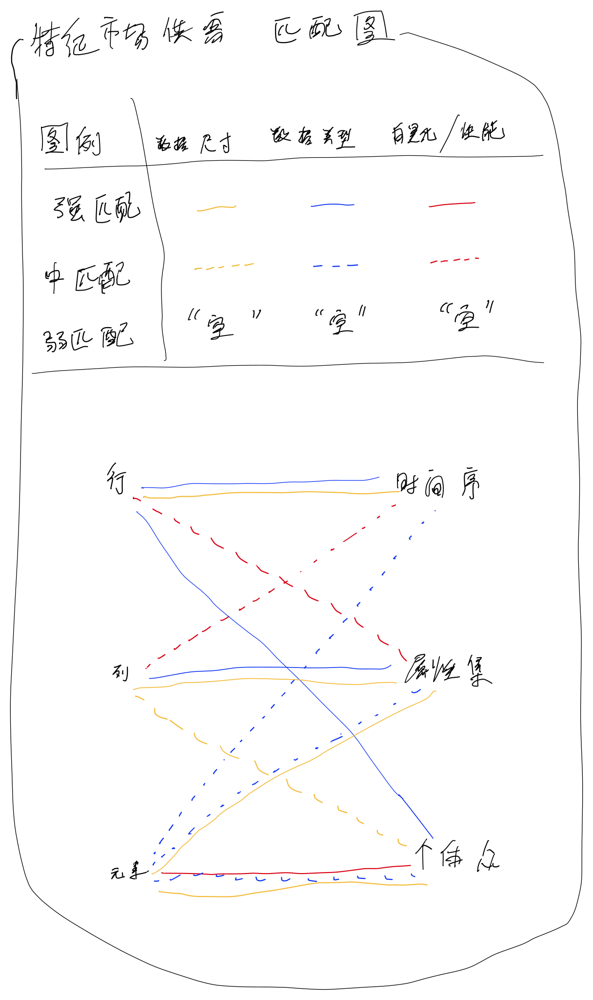

# 案例：思维过程之于设计变量之数据表示结构

tags: #类型/分析 #日期/2023-01-02 #类型/想法 #项目/CIS #内容/思维 #内容/机制 #项目/ECS 

# 描述

这时候涉及到几个分析和推理：
简要的分析和推理过程：
- 现状1：dataframe数据框数据结构有3个位置「行」、「列」、「元素」。而需要填入的数据种类有3种：「个体列表」、「类别属性」（或者简称「属性」）、「时间」。那么：
- 目标1：需要将3种数据种类一一对应分别填入3个位置。
- 问题1：哪个数据种类填入哪个位置呢？
- 推理1：这里涉及到6种情况。这里再继续推理：
- 知识2.5：「行」之尺寸容易变动。
- 知识2.6：「列」之尺寸容易变动。
- 推理2.5：根据【知识2.5】、【知识2.6】，推断「行」、「列」二者相近，因为二者尺寸容易变动，且二者不容易直接用numpy之array数据类型直接做向量化运算。可以简并为位置「行列」。
- 知识3：「元素」尺寸很难变动，一旦变动就会造成单列数据类型和尺寸不一致问题。且直接用numpy之array数据类型直接做向量化运算。
- 推理2：根据【知识2】、【知识3】，得出可以简化【目标1】为【目标2】。
- 目标2：需要将3种数据种类分别填入2个位置，其中优先考虑「元素」这个位置。
> 备注：这里继承【问题1】为【问题2】。解决【问题2】，用于实现【目标2】。【目标2】继承【目标1】。实现【目标2】，有助于实现【目标1】。
- 问题2：「元素」位置放什么数据种类？「行」或者「列」放什么数据种类？
- 推理3：在一次模型运行过程中，对于初始化数据阶段而言，最好是将不易变动的数据尺寸填入「元素」，反之亦然。
- 目标3：需要考虑哪些个数据尺寸不易变动。
- 推理4：「类别属性」在一次模型运行过程中，不易变动。因为这个是应该在模型设计的时候就设计好所有的类别种类的。
- 解答2：「类别属性」填入「元素」。
- 知识4：「元素」内的数据建议是一致的，因为这样更适合用numpy之array数据类型直接做向量化运算。
- 目标4：实现【目标1】，同时满足运行性能好。运行性能好主要指能够用numpy之array数据类型实现频繁的、数据量较大的运算过程。
- 目标5：实现【目标2】，同时满足尺寸变动程度在合理情况内。暨主要指的是「元素」类别尺寸尽可能少变动，
> 备注：【目标4】、【目标5】是后来添加的，一开始推理的时候我并没有想到要加入它们。
- 知识5：「个体列表」适合使用numpy之array数据类型实现频繁的、数据量较大的运算过程。
- 知识6：因为「类别属性」有多个类别属性变量集合而成，因此其数据类别和数据尺寸各个存在差异。
- 知识7.2：「行」要求数据类型一致。
- 知识7.3：「列」允许数据类型不一致。
- 推理7：根据【知识7.2】、【知识7.3】，推翻【推理2.5】之结论。二者不是相近。因此不能简并为位置「行列」。
- 推理8：根据【知识7.3】、【知识6】，可以认为「类别属性」更适合放入「列」。
- 知识8.2：「个体列表」数据类型一致。
- 知识8.4：「时间」数据类型一致。
- 推理9：根据【知识7.2】、【知识8.2】、【知识8.4】，可得「时间」、「个体列表」适合放入「行」或者「元素」。

……随着初步的试探性的推理，很快地，直觉给出了这样的结果：

当思路渐渐清晰之后，梳理出了以下的分析图表：

# 总结和推论

对于上述的简要的分析和推理过程的一些总结和推论：
- 推理节点随着推理过程而相互连接。
- 推理过程可以并行。
- 新的推理过程可以不断推翻、改变旧的推理过程。因为推理过程存在一个评判机制，检查这个推理过程在主观层度上是否合适。这个主观自认为参考了客观。
- 不同的推理模式可以造成不同的推理过程，从而导致不同的推理结果。
- 旧的推理过程可能是更接近正确答案的，但是有可能会被新的推理过程误导。
- 「分析」、「知识」、「问题」、「目标」等推理节点可以随着推理过程而互相交互、改变、滑动游移其内容意义和元素类别，也可以衍生、继承、分裂、合并出新的元素节点。例如「推理」得出的结论可以变成新的「知识」。
- 推理节点类型可以被新增。