# 生机系统 Entelechy System 之理论

> [!info] 版本
> V0.2.1
>
> 该版本起于2022年06月07日，于岳麓山下桃子湖畔，至于今为2022年。

# 灵感来源：

- 产生、整合、归纳、分析自己从过去以来至今的思考结果，继承自原有的三个项目：
	- Elemental Cognition System；
	- Life Management System；
	- Agents World System；
- 借鉴和吸收人类文明优秀的知识结晶，包括且不限于：
	- 借鉴吸收现有许多关于人工智能理论之思想和实现，包括深度学习（2018年附近）、强化学习（2018年附近）、因果推断（2018年前后）、图学习（2018年附近）、图形图像处理（2018年附近）、自然语言处理（2018年附近）。
	- 现有许多关于数学和系统科学理论之思想，包括复杂网络（2018年之前）、最优控制（2018年之前）等、动力系统（2018年之前）、概率统计（2018年之前）等；
	- 借鉴吸收一些现有社会科学领域如：哲学领域、心理学领域、认知科学领域、语言学领域、马克思哲学思想、中国传统文化如易经等思想、侯世达之一些著作之思想、进化论思想等；
	- 借鉴一些现有应用科学领域如生理学、脑神经科学、机械工程学、系统工程学、复杂系统理论等领域知识；
- 借鉴和吸收各类论坛、交流群、学会的交流成果。特别鸣谢：
	- 集智俱乐部；
	- 中国通用人工智能协会官方群；
- 有益的理论、模型、工具、框架、程序。包括但不限于：
	- NARS系统之有益思想和实现代码（2021年附近）；
	- he4o系统之有益思想和实现代码（2021年附近）；
	- 虚构开放大世界建模[虚构开放大世界建模](http://blog.sciencenet.cn/blog-33982-1207233.html)；
	- 其它一些古老哲学思想；

# 构想篇

# 简介

**生机系统**（Entelechy System，ES）。该系统是一个同时在宏观世界交互尺度、微观运作尺度、中观个体认知尺度互相交互的系统。

# 相关文件

- [相关理论的仓库](https://github.com/EntelechySystem/EntelechySystem_theory.git)
- 相关开发的仓库：如下文所述。

# 描述

## 构成

生机系统由四大子系统构成。这四个子系统相关的开发的仓库链接为：

-   [复杂智能体系统（Complex Intelligence System, CIS）](https://github.com/EntelechySystem/ComplexIntelligenceSystem.git)；
    
-   [基本概念系统（Elemental Conception System，ECS）](https://github.com/EntelechySystem/ElementalConceptionSystem.git)；
    
-   [生命周期管理系统（Life Management System，LMS）](https://github.com/EntelechySystem/LifeManagementSystem.git)；
    
-   [多智能体世界系统（Agents World System，AWS）](https://github.com/EntelechySystem/AgentsWorldSystem.git)；
    

### 生机系统之四分法

生机系统各子系统按照四分法法可以划分如下：静态的四象限与动态的四互动。

#### 生机系统之四象限

生机系统之四象限通过两个维度，划分系统为四个象限，每个象限各对应一个子系统。

#### 生机系统之四互动

生机系统之四互动按照子系统之互动方式如下。

## 畅想针对的智能体类型

这里面要区分两种类型的智能体。第一种是[[理想智能体]]，第二种是[[类人智能体]]。我们怎么去理解呢？这边就打个比方，【理想空间想象机制】，就类似于计算机，现在目前我们所使用的计算机的计算能力那样还有计算程序量，只要你输入的数据正确、算法思路正确、程序实现正确、没有收到其他其他奇怪干扰作用，那么事实上你会发现它程序运行过程都是精准无误的，而【类人智能体】，他更符合人类的实际特征。嗯，就是有并非持久地、专门地、有目的性的注意力机制，感知、输出控制、行为、思维过程中容易分心，容易被干扰、其分析产生哪些东西，其实有很大的不确定性，容易出现疲劳现象。

如何描述疲劳现象？此时有两种方法可以描述：一是取巧，模拟该现象，一般出现于游戏设计中；第二种是正规证据研究该现象。

这两类智能体，我认为至少目前【理想智能体】在分析当中更容易被分析，所以我们要做研究的话，做那个分析的话，就先从这种简单的相对简单的情况来入手。如果我们发现这条探索之路是歧途时，我们将考虑转向分析【类人想象力机制】，或者如果我们发现这条探索之路基本走到一个阶段之时，可以考虑转向分析更为复杂的这条探索之路。

# 研究路径

关于研究路径的想法还比较粗浅。具体还处于边行动边思考的阶段。

对于子系统CIS。一方面，以模块化方式构造功能件，各种嵌套组装。不知道见过工厂流水线没有，能不能想象得出来。组装功能件的过程有点像装配零件那样，最后生产出一台台机器。机器呢要生产产品。工厂流水线里的一台台机器加工源源不断运进来的耗材。切削掉材料的无用部分，保留有用的部分，那就是产品啦。就有点像认知过程那样，对源源不断输入的信息，去伪存真，最终沉淀固化为知识。至于产品，可以有几大类。第一类是显化的商品。第一类是未显化的商品。第三类是显化的机器。第四类是未显化的机器。固定生产线优点是生产特定产品效率很高，成本很低。缺点是难以适应其他不同种类生产需求的生产。对比思维就是那种固化了的、形成条件反射的那种思维模式。这种模式专注于应对常常面对的已经发生的事情或者处境。比如说日常工作生活中的习惯性的活动：刷牙洗脸、过马路、写熟悉的代码。柔性生产线与固定生产线相反。优点是能够灵活调整生产计划、能够迅速地切换到生产新类型的产品。缺点是如果生产特定产品，生产效率不高。对比思维就是那种灵活的、创造性的思维模式。怎么布置生产线，其实就是怎么去生成有用知识的过程。

在感官构建方面，构建视觉这方面比较难，如果迭代开发的话，可以先构建一个没有视觉、听觉、触觉、味觉世界的系统，输入信息全部是文本，通过文本“看见”这个世界。输出信息有文本，输出行为是类似棋类的运动方式。该系统核心是语言、逻辑、思维。然后第二代的时候，考虑用外面的成熟一些的技术接入，慢慢引入更丰富的感官：视觉、听觉、触觉等等，引入更丰富的输出方式。经过迭代之后，就形成了更丰富的智能系统。

对于子系统CIS和AWS。另一方面，考虑将系统人为划分成很多微小个体、具体功能。每个个体赋予功能，各个个体之间相互协调配合运作。有划分才便于研究。就像社会化生产需要分工协作那样。至于个体是什么，可以是某个独立单元、某个功能模块、也可以是神经官能团、神经元、有机大分子。如果直接从神经元级别出发、甚至从营养汤里的有机大分子级别出发，令其自发演化，也不是不能形成智能，但是这样研究不容易发现待研究对象的智能特性，或者不容易做白盒化的解释。

文化、文字、语文、语言，是作为思维的重要载体，非常值得以此为切入点，研究智能。另外，想象力，包括空间想象、文学想象、数学逻辑想象力创造力，也很重要。我觉得说文解字这样的读物，很值得一看，包括易经里的64卦，其实也蕴含了人生的哲理，智能的哲理。以上属于宏观知识层面，对应于子系统ECS。

对于开发顺序：优先是地基，就是模块的最基本的处理过程、然后逻辑、然后语言、然后视觉。但是不是严格的顺序，因为中间可能会有交织穿插。因为语言和视觉作为知识概念的载体，不能割裂开。先从显意识的思维层次构建AGI，然后再深入潜意识层面，构造载体和实现，比如神经元网络等。尽管，显意识的思维是其低层神经元电信号各种复杂作用的涌现现象，但是我的想法就是先从显意识入手。还有就是从具体案例入手，再一般化。

> [!help]
[[交流：关于如何开发AGI的想法]]
![[程序设计.drawio]]

# 相关资料

> [!reference：生机系统之子系统]
> - [[基本概念系统]]
> - [[档案：一类生命周期管理系统畅想]]
> - [[复杂多智能体思维认知机制运作系统]]
> 

# 资源

### 示意图

![[总体分析框架.drawio]]

![[程序设计.drawio]]

